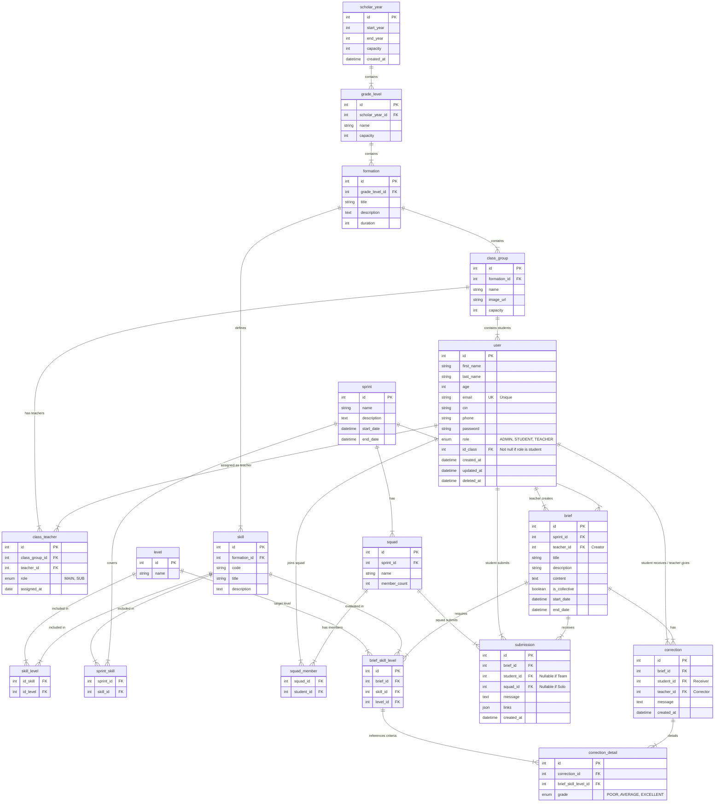

```mermaid

erDiagram

    user {
        int id PK
        string first_name
        string last_name
        int age
        string email UK "Unique"
        string cin
        string phone
        string password
        enum role "ADMIN, STUDENT, TEACHER"
        int id_class FK "Not null if role is student"
        datetime created_at
        datetime updated_at
        datetime deleted_at
    }
    
    scholar_year {
        int id PK
        int start_year
        int end_year
        int capacity
        datetime created_at
    }

    grade_level {
        int id PK
        int scholar_year_id FK
        string name
        int capacity
    }

    formation {
        int id PK
        int grade_level_id FK
        string title
        text description
        int duration
    }

    class_group {
        int id PK
        int formation_id FK
        string name
        string image_url
        int capacity
    }
    
    class_teacher {
        int id PK
        int class_group_id FK
        int teacher_id FK
        enum role "MAIN, SUB"
        date assigned_at
    }
    
    skill {
        int id PK
        int formation_id FK
        string code
        string title
        text description
    }

    level {
        int id PK
        string name
    }

    skill_level{
        int id_skill FK
        int id_level FK
    }
    
    sprint {
        int id PK
        string name
        text description
        datetime start_date
        datetime end_date
    }
    
    sprint_skill {
        int sprint_id FK
        int skill_id FK
    }

    squad {
        int id PK
        int sprint_id FK
        string name
        int member_count
    }
    
    squad_member {
        int squad_id FK
        int student_id FK
    }

    brief {
        int id PK
        int sprint_id FK
        int teacher_id FK "Creator"
        string title
        string description
        text content
        boolean is_collective
        datetime start_date
        datetime end_date
    }
    
    brief_skill_level {
        int id PK
        int brief_id FK
        int skill_id FK
        int level_id FK
    }
    
    submission {
        int id PK
        int brief_id FK
        int student_id FK "Nullable if Team"
        int squad_id FK "Nullable if Solo"
        text message
        json links
        datetime created_at
    }

    correction {
        int id PK
        int brief_id FK
        int student_id FK "Receiver"
        int teacher_id FK "Corrector"
        text message
        datetime created_at
    }

    correction_detail {
        int id PK
        int correction_id FK
        int brief_skill_level_id FK
        enum grade "POOR, AVERAGE, EXCELLENT"
    }

    scholar_year ||--|{ grade_level : "contains"
    grade_level ||--|{ formation : "contains"
    formation ||--|{ class_group : "contains"
    formation ||--|{ skill : "defines"
    
    class_group ||--|{ user : "contains students"
    user ||--|{ class_teacher : "assigned as teacher"
    class_group ||--|{ class_teacher : "has teachers"
    
    sprint ||--|{ squad : "has"
    squad ||--|{ squad_member : "has members"
    user ||--|{ squad_member : "joins squad"
    
    sprint ||--|{ sprint_skill : "covers"
    skill ||--|{ sprint_skill : "included in"

    skill ||--|{ skill_level : "included in"
    level ||--|{ skill_level : "included in"
    
    sprint ||--|{ brief : "includes"
    user ||--|{ brief : "teacher creates"
    
    brief ||--|{ brief_skill_level : "requires"
    skill ||--|{ brief_skill_level : "evaluated in"
    level ||--|{ brief_skill_level : "target level"
    
    brief ||--|{ submission : "receives"
    user ||--|{ submission : "student submits"
    squad ||--|{ submission : "squad submits"
    
    brief ||--|{ correction : "has"
    user ||--|{ correction : "student receives / teacher gives"
    
    correction ||--|{ correction_detail : "details"
    brief_skill_level ||--|{ correction_detail : "references criteria"

```